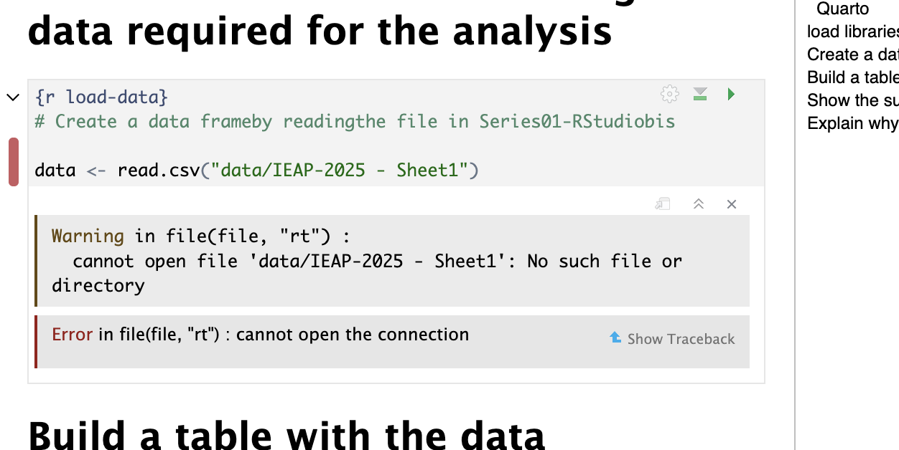

# Git-Series-00
This repository is used to learn the basics of Git and GitHub
Something about your background about Git and GitHub
That you are looking forward to learn more about Git and GitHub

## Motivations
Learning Python and R is essential for automating the processing and analysis of our biomechanical data. Mastering Git and GitHub will allow me to secure my research codes. I want to understand how to link computer science with human physiology for my future projects.

## Summary and Conclusion
Main concepts learned: Version control, branches, commits, merging, and pushing to a remote repository.
Main commands used: clone, branch, commit, push.
This assignment helped me structure project folders and secure code history.
This work took me about 1 hour to complete.